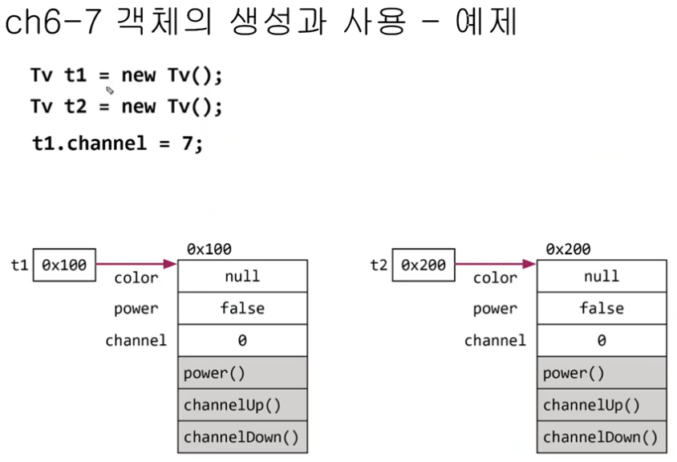
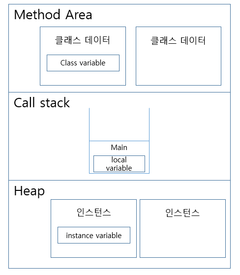

# 1. 객체의 생성

        클래스명 변수명;
        변수면 = new 클래스명();

        Tv t; // 1. 참조변수(리모컨)
        t = new Tv(); // 2. Tv인스턴스를 생성한 후, 3. 리모컨에 연결

        Tv t = new Tv(); // 1~3 과정 압축

# 2. 객체의 사용
        t.channel = 7;
        t.channelDown();
        System.out.println("채널은: " + t.channel);

### 객체 생성시 메모리

만약 t2 = t1; 을 하게 되면 t2은 t1의 메모리 주소를 저장하게된다.
그리하여 t2객체는 사용 불가상태가 되어 가비지컬렉터가 t2객체를 삭제한다.

